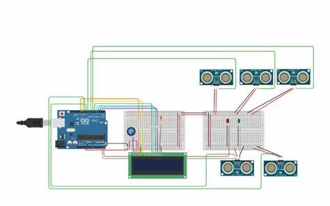

# 🚗 IoT Smart Car Parking System

A C++ simulation of a smart parking system that manages car entries, exits, and live parking slot status using simple logic and terminal interaction.

---

## 💡 Project Overview

This project mimics a basic IoT-based smart car parking system using C++. It simulates parking slots and allows a user to park or remove cars, check slot status, and handle full or invalid entries. It’s a beginner-friendly implementation meant to demonstrate the core concept of intelligent parking automation.

---

## 🛠 Tech Stack

- 🖥️ **C++**
- 🧠 **OOP Concepts**
- 💻 **Tinkercad (conceptual simulation)**  
- 🧪 **Command Line Interface (CLI)**

---

## 📂 Features

- Dynamically allocates available parking slots  
- Allows cars to enter and exit the system  
- Checks for full lot or invalid slot numbers  
- Displays real-time status of all slots  

---

## 📄 Code

📄 Code  
## 📄 Code
The main logic is written in [iot c++.txt](iot%20c%2B%2B.txt). It simulates a smart parking system using C++ concepts. 

---

## 🖼 Screenshot

---

## 🌐 Live Demo

❌ *Not hosted online. This is a C++ CLI simulation.*

